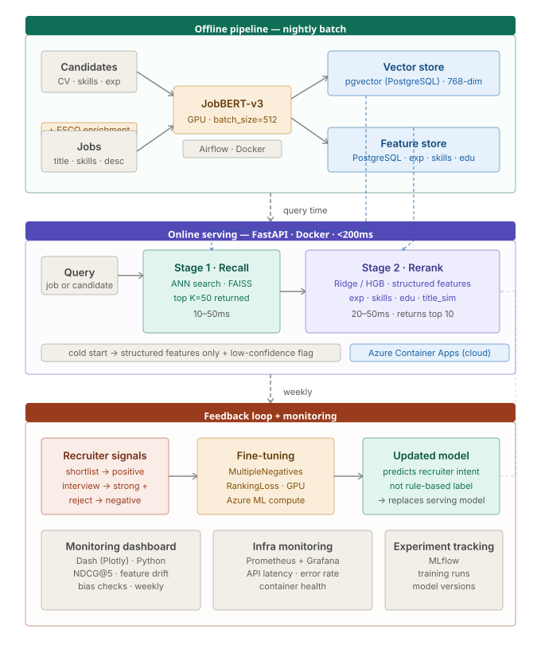

# Production Design
## Candidate–Job Matching System

---

## How it works

The system runs in two stages. Embedding inference is expensive, so it happens **offline** — the online path is just retrieval and scoring, under 200ms.

```
OFFLINE  (nightly)
  All candidate + job profiles → JobBERT-v3 → stored as vectors
  Structured features precomputed and stored

ONLINE  (per query)
  New job/candidate → find top 50 similar profiles (ANN search)
                    → rerank top 50 using structured features
                    → return top 10

FEEDBACK  (weekly)
  Recruiter actions → fine-tune the model → redeploy
```

---



---

## Components

| Layer | Tool | What it does |
|---|---|---|
| Encoding | JobBERT-v3 (GPU, offline) | Converts text to vectors |
| Vector database | pgvector (PostgreSQL extension) | Stores and searches vectors by similarity |
| Feature store | PostgreSQL | Stores structured features per candidate/job |
| API | FastAPI | Serves ranking requests |
| Containers | Docker | Packages everything, reproducible environments |
| Batch pipeline | Airflow | Schedules nightly encoding job |
| Monitoring | Dash (Plotly) | Live dashboard: NDCG, feature drift, bias checks |

---

## Cloud

Deploy on **Azure** — likely the natural fit for Spencer Stuart given existing Microsoft infrastructure. Azure Container Apps for serving, Azure Machine Learning for batch encoding, Azure AI Search for vector storage, Azure Blob for model artefacts.

GDPR: candidate CV data is personal data. EU Azure regions handle data residency without additional configuration.

---

## Data flywheel

The current model predicts a rule-based label — a proxy for recruiter judgment. The flywheel closes that gap.

Every recruiter action is a training signal: shortlisting a candidate is a positive, rejecting is a negative. These pairs feed weekly fine-tuning. After a few months the model predicts what recruiters actually want, not what the original scoring formula computed.

**This is the most valuable long-term investment in the system.**

---

## Cold start

- **New candidate:** fall back to structured features only, flag low confidence to recruiter
- **New job with no skills listed:** ESCO enrichment resolves this offline before the job enters the system

---

## Monitoring

The Dash dashboard tracks:
- NDCG@5 on held-out recruiter decisions (weekly trend)
- Feature drift — exp_deficit mean, score distribution per job
- Bias check — shortlist rates by experience level and degree

Alert if NDCG drops more than 5% week-over-week.

---

## Latency budget

| Stage | Time |
|---|---|
| Vector search (ANN) | 10–50ms |
| Feature lookup | 10–20ms |
| Reranking (top 50) | 20–50ms |
| Network | 20–30ms |
| **Total** | **< 200ms** |
